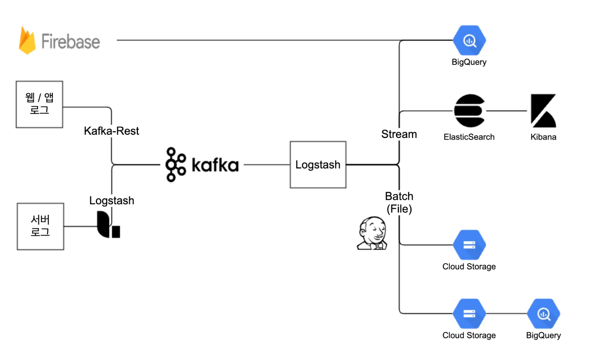

# [NBT] 데이터 파이프라인 마이그레이션

상태: 완료 🙌
작성일시: 2025년 9월 24일 오후 11:33

# 개요

- GCP 초기 서울리전이 없다보니 도쿄리전에 데이터 파이프라인이 구축되어 불필요한 리전간 통신비용 발생
- 개발 환경에는 데이터 파이프라인이 없는 서비스들도 존재하여 로그 확인이 불가능한 환경 개선

# 데이터 파이프라인 구조



- 서버에서 생성된 로그들은 Logstash를 이용하여 Kafka-Cluster로 메시지 전송, 웹 / 앱에서 생성된 로그들은 Lumberjack을 통해 Kafka-Rest로 메시지를 Producing 하는 파이프라인
- Kafka Topic으로 구분된 메시지를 ELK Stack을 활용하여 로그를 확인하고, 백업 및 분석을 위해 파일로 저장 후 GCS 혹은 BigQuery로 적재되는 파이프라인

# 파이프라인 개선

## Kafka Cluster

- 카프카 클러스터의 브로커 3대 → 5대로 증설
    - Confluent Platform : 3.2.x, kafka : 0.10.2.x → Confluent Platform : 7.3.x, Kafka : 3.3.x
    - partition 3, replication factor 2의 설정으로 토픽 생성하여 운영중이었고 특정 시간대에 원인 미상의 이유로 로그 유실 발생중이었음 → 5대로 증설 후 로그 유실 해결됨

## Kafka UI 도입

- Kafka Cluster 관리를 위해 Kafdrop, Kafka UI 테스트를 통해 Kafka UI 도입
    - Kafka UI가 UI가 더 깔끔하였고 토픽 read only 기능을 제공하여 UI 상에서 토픽 삭제 방지가 가능하여 Kafka UI 도입 결정

## Consumer Logstash

- 약 50여대로 운영중이던 Logstash 서버들을 5대로 통합하여 구축 → 관리 포인트 감소
    - ES Stream 적재 2대
    - File로 저장(GCS 적재 및 BigQuery 배치 적재 목적) 및 BigQuery Stream 적재 3대

## 적재 스크립트 개선

- 젠킨스를 이용하여 시간별 파일로 저장한 로그를 GCS로 적재하는 배치 잡에 사용되는 스크립트를 템플릿화 하여 개선
    - 개선 전 : 배치 잡을 생성할때마다 스크립트 추가
    - 개선 후 : 스크립스 실행시 아규먼트 전달받아 템플릿 스크립트 실행

```bash
#!/bin/bash
set -xe

. /etc/environment

target_year=$(date +%Y --date="1hour ago")
target_month=$(date +%m --date="1hour ago")
target_day=$(date +%d --date="1hour ago")
target_date=$(date +%Y-%m-%d:%H --date="1hour ago")

file_location="$1"
log_type="$2"
gcs_bucket="$3"
gcs_log_type="$4"

file_dir="${file_location}"
file_gcs_dir="${file_dir}/to_gcs"
file_name="${log_type}-${target_date}.log"
file_path="${file_dir}/${file_name}"
echo $file_path

# 해당 시간대에 생성된 로그가 없을경우 실패얼럿이 오지 않도록 종료
if [ ! -f "${file_path}" ]; then
  echo "${file_path} is not exist."
  exit 0
fi

gcs_prefix="gs://${gcs_bucket}/${gcs_log_type}"
gcs_path="${gcs_prefix}/${target_year}/${target_month}/${target_day}"

echo "Copy to GCS ( ${gcs_path}/${file_name} )"
gzip -c $file_path > $file_gcs_dir/${file_name}.gz && gsutil -m cp $file_gcs_dir/${file_name}.gz $gcs_path/${file_name}.gz
rm $file_gcs_dir/${file_name}.gz
rm $file_path
```

## Logstash Kafka Output Compression 옵션 적용

- Lz4 Compression Type 테스트 후 적용하여 Kafka Cluster의 디스크 사용량 절감
    - Gzip, Snappy, Lz4, Zstd를 지원하지만 CPU 사용량이 가장 적고 압축 속도도 가장 빠르기때문에 Lz4 사용 결정
    - 테스트 결과 Lz4 옵션 사용시 압축하지 않은 토픽 대비 24% 크기 감소 확인

## ES Cluster 구조 변경

- 기존
    - 서비스별 ES Cluster 구축
- 개선
    - 개발팀별 ES Cluster 구축
    - ES Cluster 6개 → 3개로 변경
    - 관리 포인트 감소 및 개발팀 Kibana 접근성 개선

# **기존 파이프라인 문제 해결**

## **로그 유실 원인 파악**

- Kafka Cluster 3대 → 5대 증설 후 특정 시간대에 유실 확인

### 유실 Case 1

- 서버에서 Logrotate 수행시 Logstash가 읽기전에 Rotate되어 서버 Rotate된 파일에는 로그가 남아있지만 적재되지 못한 경우 확인
    - Logstash의 stat_interval 조정하여 해소
- 유실 상황 검증
    - 임의로 100개의 로그 발생시키는 동안 Logrotate를 수행하여 유실이 발생하는 지 확인
- stat_interval을 조절하여 유실 최소화
    
    
    | stat_interval (second) | **1** | **2** | **3** | **4** | **5** | **평균 유실** |
    | --- | --- | --- | --- | --- | --- | --- |
    | 1 (default) | 92/100 | 93/100 | 97/100 | 88/100 | 91/100 | 7.8개 |
    | 0.5 | 99/100 | 95/100 | 100/100 | 95/100 | 96/100 | 2.8개 |
    | 0.1 | 100/100 | 100/100 | 99/100 | 100/100 | 100/100 | 0.2개 |

### 유실 Case 2

- CopyTruncate 옵션을 이용하여 Rotate 수행 중 Copy 후 Truncate를 수행하는 사이에 생성된 로그가 유실되어 서버에도 로그가 남아있지 않게되는 진짜 유실 케이스
    - stat_interval 옵션 조정하여 아주 간헐적으로 1건 발생하고있지만 완전한 해결을 위해서는 CopyTruncate 옵션을 사용하지 않고 Copy 후 새로운 로그파일 생성 → Logger에 Reopen 시그널 전달하는 방법으로 개선 필요

# 파이프라인 마이그레이션 과정

1. 각 서버의 Logstash가 기존 데이터 파이프라인, 신규 데이터 파이프라인으로 중복으로 로그 적재
2. Kibana, BIgQuery, GCS에 적재된 로그를 비교하여 검증
3. 비교 검증이 마무리된 파이프라인은 마이그레이션 진행