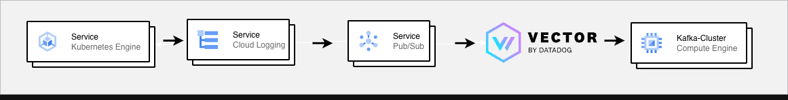

# GKE Vector 기반 Streaming Log Pipeline

## Overview

기존 VM 기반 로그 파이프라인(Logstash 중심)을 GKE 환경으로 확장하면서  
FluentD의 구조적 한계(구버전 플러그인, 단일 프로세스, 확장성 부족)를 해결하기 위해  
**Vector 기반의 Cloud-Native 로그 수집 파이프라인**을 설계·구축했습니다.

GKE에서 기본 수집되는 Cloud Logging 로그를 Pub/Sub으로 전달하고,  
Vector를 통해 Kafka Cluster로 안정적으로 전달하는 구조로 구성하여  
기존 데이터 파이프라인(Kafka–ELK–GCS/BigQuery)과 자연스럽게 통합하는 것을 목표로 했습니다.

## Problem

- VM 기반 서버 EOS로 인해 GKE 마이그레이션이 필요했습니다.
- FluentD Pub/Sub Input Plugin이 **7년 이상 업데이트되지 않은 커뮤니티 플러그인**이었습니다.
- 단일 프로세스 구조로 인해 처리량 증가 시 확장성에 한계가 있었습니다.
- FluentD 장애 발생 시 로그 적재 지연 및 운영 리스크가 존재했습니다.

## Architecture

- GKE 기본 Cloud Logging 에이전트가 컨테이너 로그를 수집합니다.
- Cloud Logging Sink를 통해 Pub/Sub Topic으로 로그를 전달합니다.
- Vector가 Pub/Sub Subscription을 Consume합니다.
- Vector에서 Kafka Cluster로 로그를 전송합니다.
- Kafka 이후 파이프라인은 기존 ELK / GCS / BigQuery 적재 구조를 재사용했습니다.

### 구성 요소

- **GKE (Google Kubernetes Engine)**
  - 애플리케이션 실행 환경으로 사용했습니다.
  - 컨테이너에서 출력되는 로그는 GKE 기본 Cloud Logging 에이전트를 통해 자동 수집했습니다.

- **Cloud Logging / Pub/Sub**
  - GKE에서 수집된 로그를 Managed 서비스로 전달했습니다.
  - 별도의 로그 수집 DaemonSet 운영 없이 안정적인 로그 전달 구조를 제공했습니다.

- **Vector**
  - Pub/Sub Subscription을 Consume하여 로그를 수집 및 변환했습니다.
  - 멀티 프로세스 기반 구조를 통해 높은 처리량과 안정성을 확보했습니다.
  - Kafka Sink를 통해 중앙 로그 스트리밍 파이프라인으로 로그를 전달했습니다.

- **Kafka Cluster**
  - 모든 로그 스트림을 수집하는 중앙 메시징 허브로 사용했습니다.
  - 이후 ELK, GCS, BigQuery 등 기존 Consumer 파이프라인에서 로그를 재사용했습니다.

## Key Decisions

1. **FluentD → Vector 전환**
   - 멀티 스레드/멀티 프로세스를 지원하여 처리량을 개선했습니다.
   - 활발한 유지보수와 지속적인 성능 개선이 이루어지는 도구를 선택했습니다.

2. **Cloud Logging 직접 수집 구조 채택**
   - GKE 노드별 DaemonSet 운영을 제거했습니다.
   - 로그 수집 책임을 GCP Managed 영역으로 위임했습니다.

3. **KEDA 기반 Auto Scaling**
   - Pub/Sub Lag 기반으로 Vector Pod가 자동 확장되도록 구성했습니다.

4. **Kustomize 기반 GitOps 구성**
   - 환경별 설정을 분리하고 변경 이력 관리가 용이하도록 구성했습니다.

## Implementation

### Image Build & CI

- `Dockerfile`
  - Vector 공식 이미지를 기반으로 설정 파일을 포함했습니다.
- `cloudbuild.yaml`
  - Cloud Build를 통해 이미지를 빌드했습니다.
  - Artifact Registry로 이미지를 Push했습니다.
  - GitOps Repository와 연계하여 배포가 이루어지도록 구성했습니다.

### Kubernetes Deployment

- `deployment.yaml`
  - Vector Deployment를 정의했습니다.
  - 리소스 제한 및 환경 변수를 설정했습니다.
- `configmap.yaml`
  - Pub/Sub Source 및 Kafka Sink 설정을 포함했습니다.
- `kustomization.yaml`
  - 공통 리소스를 묶어 관리하도록 구성했습니다.

### Auto Scaling

- `scaled_object.yaml`
  - Pub/Sub Subscription Lag 기준의 스케일링 정책을 정의했습니다.
- `trigger_auth.yaml`
  - GCP 인증 정보를 Secret과 연동하여 참조하도록 구성했습니다.

## Operations

- **배포**
  - Git 변경 → ArgoCD Sync → GKE 반영 흐름으로 배포를 수행했습니다.
- **스케일링**
  - Pub/Sub 메시지 적체 시 자동으로 Scale-out 되도록 구성했습니다.
  - 유휴 상태에서는 최소 Replica를 유지했습니다.
- **모니터링**
  - Vector internal metrics를 모니터링했습니다.
  - Kafka Consumer Lag를 확인했습니다.
  - Pub/Sub backlog를 지속적으로 관찰했습니다.

## Troubleshooting

- **FluentD Pub/Sub Input 불안정**
  - 고부하 상황에서 메시지 처리 지연이 발생했습니다.
  - 재시작 시 Subscription offset 관리가 어려웠습니다.
  - → Vector로 전환한 이후 해당 문제를 해소했습니다.

- **초기 Throughput 튜닝**
  - batch size 및 commit interval 조정을 통해 Kafka 적재 안정화를 수행했습니다.

## Results

- **Before → After**
  - FluentD 단일 프로세스 → Vector 멀티 프로세스로 전환했습니다.
  - 수동 Pod 증설 → Pub/Sub Lag 기반 Auto Scaling으로 개선했습니다.
  - 로그 적재 지연 발생 → 지연 없이 실시간 처리가 가능해졌습니다.

- **정량 성과 (측정 기준: 피크 트래픽 시간대)**
  - 로그 처리 안정성: 장애 및 지연 케이스 **0건**
  - 운영 관리 대상: 로그 수집 컴포넌트에서 **FluentD 제거**
  - 배포 소요 시간: 수동 작업 대비 Git Merge 기준 **수 분 이내로 단축**

## Tech Stack

- **Infra**: GKE, Cloud Logging, Pub/Sub
- **Streaming**: Kafka
- **Log Pipeline**: Vector
- **CI/CD**: Cloud Build, Artifact Registry, ArgoCD
- **Deployment**: Kubernetes, Kustomize, KEDA

## Next Steps

- **Pub/Sub Lag + 처리 지연 시간 기반 복합 스케일링**
  - 단순 메시지 backlog 수뿐 아니라
    - Vector internal processing latency
    - Kafka Produce latency
  - 를 함께 고려하여 스케일링 조건을 정교화할 예정입니다.

- **HPA Limit 및 비용 최적화**
  - 최대 Replica 수 상한을 설정하여
    - 예기치 않은 트래픽 폭증 시 비용 증가를 방지할 계획입니다.
  - 피크 시간대와 비피크 시간대의 스케일링 패턴을 분석한 후
    - Threshold 동적 조정을 검토할 예정입니다.
