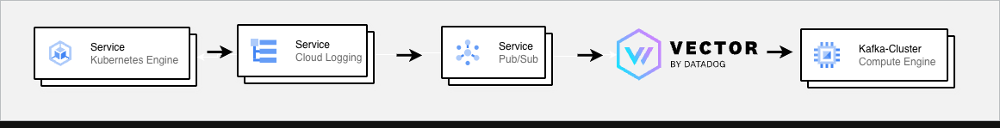

# GKE Vector 기반 Streaming Log Pipeline

## Overview

기존 VM 기반 로그 파이프라인(Logstash 중심)을 GKE 환경으로 마이그레이션하며 FluentD의 구조적 한계(구버전 플러그인, 단일 프로세스, 확장성 부족)를 극복하기 위해 **Vector 기반의 로그 수집 파이프라인**을 설계·구축했습니다.

특히, 1차 마이그레이션 완료에 안주하지 않고 **지속적인 모니터링과 비용 분석을 수행**하여 기존 **GKE → Pub/Sub → Vector (Deployment) → Kafka** 구조의 비용/구조적 개선점을 발굴했습니다. 이를 바탕으로 **GKE → Vector (DaemonSet) → Kafka** 구조로 점진적 아키텍처 고도화를 단행하여 불필요한 Managed 서비스 비용을 제거하고 실시간 처리 성능을 극대화했습니다.

## Architecture

### 1. 기존 아키텍처 (Deployment 구조)

- **흐름**: GKE (Cloud Logging) → Cloud Logging Sink → GCP Pub/Sub → Vector (Deployment) → Kafka
- **특징**: GCP Managed 서비스(Cloud Logging, Pub/Sub)를 거쳐 로그를 간접 수집하는 구조이며, KEDA를 통해 Pub/Sub Lag 기반으로 Vector Deployment를 오토스케일링했습니다.

### 2. 개선 아키텍처 (DaemonSet 구조)
- **흐름**: GKE 컨테이너 로그 (Node Disk) → Vector (DaemonSet) → Kafka
- **특징**: 중간 매개체인 Cloud Logging과 Pub/Sub을 생략하고, 각 GKE 노드에 Vector를 DaemonSet으로 배포하여 노드 파일 시스템에서 로그를 직접 수집 및 Kafka로 즉시 전송하는 고효율 구조입니다.

---

### 개선 배경 및 기대 효과 (비용 최적화)
- **불필요한 비용 발생 제거**: GKE에서 대량의 로그를 Cloud Logging과 Pub/Sub으로 중복 전송하면서 과도한 Pub/Sub 처리 비용 및 Cloud Log Storage 비용이 발생했습니다.
- **인프라 비용 약 60% 절감 기대**: 중간 버퍼인 Pub/Sub 및 Managed 로깅 스토리지를 완전히 제거하고, 노드 내에서 파일 기반으로 직접 로그를 수집·전송하도록 변경하여 관련 인프라 비용을 약 60% 이상 절감할 것으로 기대됩니다.

### 구성 요소

- **GKE (Google Kubernetes Engine)**
  - 애플리케이션 실행 환경이며, 노드 레벨의 로그 디렉토리(`/var/log/pods/`)에서 직접 로그를 수집하도록 구성했습니다.

- **Vector (DaemonSet)**
  - 각 GKE 노드에 DaemonSet으로 실행되어 해당 노드의 컨테이너 로그 파일을 직접 tailing 및 변환합니다.
  - 멀티 스레드/멀티 프로세스 기반의 고성능 엔진으로 스파이크 트래픽을 안정적으로 처리합니다.

- **Kafka Cluster**
  - 모든 로그 스트림을 수집하는 중앙 메시징 허브로 사용했습니다.
  - 이후 ELK, GCS, BigQuery 등 기존 Consumer 파이프라인에서 로그를 재사용했습니다.

## Key Decisions

1. **FluentD → Vector 전환**
   - 멀티 스레드/멀티 프로세스를 지원하여 로그 수집 엔진의 성능과 처리량을 대폭 개선했습니다.

2. **비용 효율 및 구조 최적화를 위한 DaemonSet 전환**
   - 중간 인프라 레이어인 Pub/Sub과 Cloud Logging Sink를 제거하고, Vector를 GKE 노드당 1개씩 DaemonSet으로 실행하여 로그를 다이렉트로 Kafka에 수집 및 적재하도록 변경했습니다.
   - 이를 통해 데이터 전송 및 적재 단계에서의 불필요한 과금 요소를 원천 차단했습니다.

3. **Kustomize 기반 GitOps 구성**
   - 환경별 설정을 분리하고 변경 이력 관리가 용이하도록 구성했습니다.

## Implementation

### Image Build & CI

- `Dockerfile`
  - Vector 공식 이미지를 기반으로 설정 파일을 포함했습니다.
- `cloudbuild.yaml`
  - Cloud Build를 통해 이미지를 빌드하고 Artifact Registry로 Push하는 파이프라인을 구축했습니다.

### Kubernetes DaemonSet

- `daemonset.yaml` [NEW]
  - GKE 노드 단위로 Vector를 배치하기 위한 DaemonSet 리소스를 정의했습니다.
  - 노드의 `/var/log/pods/` 디렉토리를 볼륨 마운트하여 컨테이너 로그에 접근할 수 있도록 설정했습니다.
- `configmap.yaml`
  - Node File Source 및 Kafka Sink 설정을 포함했습니다.
- `kustomization.yaml`
  - 공통 리소스를 묶어 관리하도록 구성했습니다.

## Operations

- **배포**
  - Git 변경 → ArgoCD Sync → GKE 반영 흐름으로 배포를 수행했습니다.
- **스케일링 및 리소스 관리**
  - DaemonSet 구조를 통해 GKE 노드가 스케일 아웃될 때 수집 에이전트(Vector)가 자동으로 함께 배치되도록 구성했습니다.
- **모니터링**
  - Vector internal metrics 및 CPU/Memory 사용량을 모니터링했습니다.
  - Kafka Consumer Lag를 확인하여 유실 없이 스트림이 전달되는지 관찰했습니다.

## Troubleshooting

- **FluentD Pub/Sub Input 불안정 (기존 구조 이슈)**
  - 고부하 상황에서 메시지 처리 지연이 발생했습니다.
  - 재시작 시 Subscription offset 관리가 어려웠습니다.
  - → Vector로 전환한 이후 해당 문제를 해소했습니다.

- **초기 Throughput 튜닝**
  - batch size 및 commit interval 조정을 통해 Kafka 적재 안정화를 수행했습니다.

- **DaemonSet 전환 중 스파이크성 로그 누락 현상**
  - **문제**: Kubernetes logs Source Type을 사용 중, 특정 서비스에서 스파이크성 대량 로그가 발생할 때 일부 로그가 유실되는 현상을 발견했습니다.
  - **원인**: Vector가 미처 처리(Read)하기 전에 K8s 노드의 Log Rotate가 발생하여 파일이 변경/삭제됨을 확인했습니다. 특히 `/var/log/containers` 경로는 심볼릭 링크이기 때문에 로테이트 시 Vector가 원본 파일을 추적하지 못하고 유실이 발생했습니다.
  - **해결**:
    1. Vector의 수집 방식을 `kubernetes_logs` 대신 `file` source 방식으로 변경했습니다.
    2. 수집 대상 경로를 심볼릭 링크인 `/var/log/containers/*.log`에서 실제 물리 로그가 쌓이는 `/var/log/pods/` 디렉토리(예: `/var/log/pods/pod_name/`)로 변경했습니다.
    3. 로테이트된 파일도 디스크에서 실제로 삭제되기 전까지는 Vector가 지속적으로 추적(track)하여 끝까지 읽을 수 있도록 설정을 보완하여 로그 누락을 완벽히 방지했습니다.

## Results

- **Before → After**
  - **기존 VM 기반**: FluentD 단일 프로세스 + Logstash → 고부하 시 지연 및 유실 발생.
  - **1차 개선 (Deployment)**: Vector (Deployment) + GCP Pub/Sub 버퍼링 → 처리 속도는 개선되었으나 Pub/Sub 및 Log Storage로 인한 추가 비용 발생.
  - **2차 개선 (DaemonSet)**: Vector (DaemonSet) 노드 직접 수집 → 중간 인프라 비용 절감 및 지연 시간 단축, file source 기반 로테이트 대응으로 유실 방지.

- **정량 성과**
  - **비용 최적화**: 불필요한 Pub/Sub, Cloud Log Storage 제거를 통해 로깅 인프라 비용 **약 60% 절감 기대**.
  - **로그 처리 안정성**: 스파이크성 로그 유실 문제를 해결하여 장애 및 지연 케이스 **0건**.
  - **운영 효율성**: 수동 배포 및 복잡한 scaling 관리 최소화 (노드 증가 시 DaemonSet 자동 배포).

## Tech Stack

- **Infra**: GKE
- **Streaming**: Kafka
- **Log Pipeline**: Vector (DaemonSet, File Source)
- **CI/CD**: Cloud Build, Artifact Registry, ArgoCD
- **Deployment**: Kubernetes, Kustomize

## Next Steps

- **Vector 리소스 튜닝 및 Limit 최적화**
  - 노드별 자원 사용량을 분석하여 각 DaemonSet Pod의 CPU/Memory Limit을 정밀 튜닝하여 노드 자원 경쟁을 최소화할 예정입니다.

- **로그 전송 실패 시 노드 레벨 디스크 버퍼링 백업 정책 고도화**
  - Kafka 장애 등 전송 실패 시 노드 디스크 공간이 부족해지지 않도록, Vector 디스크 버퍼 용량 상한 설정 및 얼럿 임계치를 정교화할 예정입니다.
