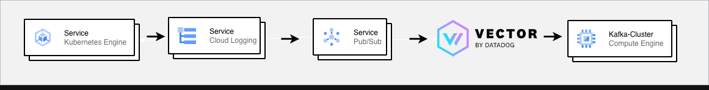

# GKE Vector 기반 Streaming Log Pipeline

## Overview

기존 VM 기반 로그 파이프라인(Logstash 중심)을 GKE 환경으로 마이그레이션하며 FluentD의 구조적 한계(구버전 플러그인, 단일 프로세스, 확장성 부족)를 극복하기 위해 **Vector 기반의 로그 수집 파이프라인**을 설계·구축했습니다.

특히, 1차 마이그레이션 완료에 안주하지 않고 **지속적인 모니터링과 비용 분석을 수행**하여 기존 **GKE → Pub/Sub → Vector (Deployment) → Kafka** 구조의 비용/구조적 개선점을 발굴했습니다. App of Apps로 관리되는 서비스는 데브옵스 엔지니어가 구성한 배포 경계를 따르고, 그 대상이 아닌 서비스는 제가 **공식 Vector chart를 포함한 Umbrella Helm chart**를 구성하여 GKE 노드의 로그 파일을 직접 수집하는 Agent(DaemonSet) 구조로 전환했습니다.

## Architecture

### 1. 기존 아키텍처 (Deployment 구조)

- **흐름**: GKE (Cloud Logging) → Cloud Logging Sink → GCP Pub/Sub → Vector (Deployment) → Kafka
- **특징**: GCP Managed 서비스(Cloud Logging, Pub/Sub)를 거쳐 로그를 간접 수집하는 구조이며, KEDA를 통해 Pub/Sub Lag 기반으로 Vector Deployment를 오토스케일링했습니다.

### 2. 개선 아키텍처 (서비스별 Helm Agent/DaemonSet 구조)
- **흐름**: GKE 컨테이너 로그 (Node Disk) → Vector Agent (DaemonSet/File Source) → Kafka
- **특징**: 중간 매개체인 Cloud Logging과 Pub/Sub을 생략하고, 배포 경계에 따라 Vector Agent를 각 GKE 노드에 배치하여 노드 파일 시스템에서 로그를 직접 수집 및 Kafka로 전송합니다.

배포 관리 경계는 다음과 같이 분리했습니다.

```text
[데브옵스 엔지니어 구성]
Argo CD App of Apps → 서비스별 애플리케이션/Helm 배포

[데이터 엔지니어 구성]
Umbrella Helm chart → Vector 공식 subchart
                   ├─ 서비스별 ConfigMap
                   ├─ PriorityClass
                   └─ Vector Agent (DaemonSet)
```

---

### 개선 배경 및 기대 효과 (비용 최적화)
- **불필요한 비용 발생 제거**: GKE에서 대량의 로그를 Cloud Logging과 Pub/Sub으로 중복 전송하면서 과도한 Pub/Sub 처리 비용 및 Cloud Log Storage 비용이 발생했습니다.
- **인프라 비용 약 60% 절감 기대**: 중간 버퍼인 Pub/Sub 및 Managed 로깅 스토리지를 완전히 제거하고, 노드 내에서 파일 기반으로 직접 로그를 수집·전송하도록 변경하여 관련 인프라 비용을 약 60% 이상 절감할 것으로 기대됩니다.

### 배포 방식 (App of Apps / Umbrella Helm 분리)

- App of Apps는 데브옵스 엔지니어가 구성한 플랫폼 배포 방식이며, 이 프로젝트에서는 해당 관리 경계와 중복되는 상위 애플리케이션 정의를 재현하지 않습니다.
- App of Apps로 관리하지 않는 서비스는 제가 부모 `gke_vector` Umbrella chart를 구성해 Vector 공식 chart를 dependency로 포함하고, 서비스별 설정과 공통 배포 정책을 한 릴리스로 묶었습니다.
- Umbrella chart의 `Chart.yaml`은 Vector 공식 subchart를 고정하고, `values.yaml`은 Agent 역할·hostPath·PriorityClass·리소스를 오버라이드합니다.
- `templates/configmap.yaml`은 `vectorConfigPath`의 서비스별 설정을 ConfigMap으로 패키징하고, `templates/priorityclass.yaml`은 GKE에서 사용할 전용 PriorityClass를 함께 생성합니다.
- Vector는 `Agent` 역할의 DaemonSet으로 실행되어 노드가 추가되면 해당 노드에도 자동 배치됩니다.
- 앱 파드보다 먼저 로그 수집기를 배치하기 위해 GKE 전용 PriorityClass를 사용하고, 종료 시 60초의 유예 시간을 두어 graceful shutdown을 보장합니다.
- `vectorConfigPath`·`vectorConfigMapName`과 서비스별 values를 분리해 로그 규칙을 관리하고, `/var/lib/vector`를 hostPath로 연결해 노드 재시작 후에도 checkpoint를 유지합니다.
- 실제 서비스명·ConfigMap명·브로커 주소는 공개하지 않고 일반화한 예시를 제공합니다.

  - [익명화된 Umbrella Chart 정의](./vector/config/umbrella-Chart.example.yaml)
  - [익명화된 Umbrella values 예시](./vector/config/umbrella-values.example.yaml)
  - [익명화된 Vector File Source/Transform/Kafka 설정 예시](./vector/config/vector-config.example.yaml)

### 구성 요소

- **GKE (Google Kubernetes Engine)**
  - 애플리케이션 실행 환경이며, 노드 레벨의 로그 디렉토리(`/var/log/pods/`)에서 직접 로그를 수집하도록 구성했습니다.

- **Vector (DaemonSet)**
  - Helm `Agent` 역할의 DaemonSet으로 각 GKE 노드에서 컨테이너 로그 파일을 직접 tailing 및 변환합니다.
  - 멀티 스레드/멀티 프로세스 기반의 고성능 엔진으로 스파이크 트래픽을 안정적으로 처리합니다.
  - File Source checkpoint를 노드 디스크에 저장하고, Kafka sink에는 디스크 버퍼·acknowledgement·idempotence를 적용합니다.

- **Kafka Cluster**
  - 모든 로그 스트림을 수집하는 중앙 메시징 허브로 사용했습니다.
  - 이후 ELK, GCS, BigQuery 등 기존 Consumer 파이프라인에서 로그를 재사용했습니다.

## Key Decisions

1. **FluentD → Vector 전환**
   - 멀티 스레드/멀티 프로세스를 지원하여 로그 수집 엔진의 성능과 처리량을 대폭 개선했습니다.

2. **비용 효율 및 구조 최적화를 위한 DaemonSet 전환**
   - 중간 인프라 레이어인 Pub/Sub과 Cloud Logging Sink를 제거하고, Vector를 GKE 노드당 1개씩 DaemonSet으로 실행하여 로그를 다이렉트로 Kafka에 수집 및 적재하도록 변경했습니다.
   - 이를 통해 데이터 전송 및 적재 단계에서의 불필요한 과금 요소를 원천 차단했습니다.

3. **App of Apps와 Umbrella Helm의 배포 경계 분리**
   - 데브옵스 엔지니어가 관리하는 App of Apps 영역과, 데이터 엔지니어가 직접 구성한 미관리 서비스용 Umbrella chart 영역을 분리했습니다.
   - Umbrella chart에서는 Vector 공식 subchart·서비스별 ConfigMap·PriorityClass를 하나의 부모 chart로 묶어 배포했습니다.

## Implementation

### Image & Helm chart

- 공식 Vector 이미지를 Helm dependency로 사용하고, 부모 chart의 `Chart.lock`으로 dependency 버전을 고정했습니다.
- 서비스별 values에서 읽을 Config 파일 경로와 ConfigMap 이름을 지정하여 동일한 Umbrella chart를 여러 서비스에 재사용할 수 있도록 구성했습니다.
- 기존 `Dockerfile`·`cloudbuild.yaml`은 1차 커스텀 이미지/배포 경로의 역사적 예시로 남겼습니다.

### Helm values & service config

- Umbrella values에서 Vector를 `Agent`로 지정하고, RBAC·ServiceAccount·toleration·전용 PriorityClass·termination grace period를 공통 정책으로 관리합니다.
- 서비스별 ConfigMap에는 `/var/log/pods/` 하위의 허용된 로그 경로만 `include`로 등록하고, `.gz`·`.tmp` 파일은 `exclude`합니다.
- File Source는 최초 기동 시 `beginning`부터 읽고, 서비스별 보존 범위에 맞춰 오래된 파일을 제외하며, rotate 대기·checksum fingerprint·CRI multiline 파싱을 적용합니다.
- Kafka sink에는 디스크 버퍼를 사용하고 버퍼가 가득 차면 block하도록 설정하여 전송 실패 시 메모리에서 이벤트가 사라지지 않도록 구성합니다.
- 이 레포의 기존 `deployment.yaml`, `configmap.yaml`, `scaled_object.yaml`은 1차 Pub/Sub·Deployment 구조를 설명하는 역사적 예시이며, 최신 익명화 예시는 위의 예시 파일들에 분리했습니다.

## Operations

- **배포**
  - App of Apps 관리 서비스는 데브옵스 엔지니어가 구성한 Argo CD 상위 애플리케이션을 통해 배포합니다.
  - 그 외 서비스는 Umbrella chart 변경 → Argo CD 애플리케이션 동기화 → GKE 반영 흐름으로 배포하도록 구성했습니다.
- **스케일링 및 리소스 관리**
  - DaemonSet 구조를 통해 GKE 노드가 스케일 아웃될 때 수집 에이전트(Vector)가 자동으로 함께 배치되도록 구성했습니다.
  - `terminationGracePeriodSeconds: 60`과 노드 디스크 checkpoint로 종료·재시작 시 재수집 및 누락 가능성을 줄였습니다.
- **모니터링**
  - Vector internal metrics 및 CPU/Memory 사용량을 모니터링했습니다.
  - Kafka Consumer Lag를 확인하여 유실 없이 스트림이 전달되는지 관찰했습니다.

## Troubleshooting

- **FluentD Pub/Sub Input 불안정 (기존 구조 이슈)**
  - 고부하 상황에서 메시지 처리 지연이 발생했습니다.
  - 재시작 시 Subscription offset 관리가 어려웠습니다.
  - → Vector로 전환한 이후 해당 문제를 해소했습니다.

- **초기 Throughput 튜닝**
  - batch size 및 commit interval 조정을 통해 Kafka 적재 안정화를 수행했습니다.

- **DaemonSet 전환 중 스파이크성 로그 누락 현상**
  - **문제**: Kubernetes logs Source Type을 사용 중, 특정 서비스에서 스파이크성 대량 로그가 발생할 때 일부 로그가 유실되는 현상을 발견했습니다.
  - **원인**: Vector가 미처 처리(Read)하기 전에 K8s 노드의 Log Rotate가 발생하여 파일이 변경/삭제됨을 확인했습니다. 특히 `/var/log/containers` 경로는 심볼릭 링크이기 때문에 로테이트 시 Vector가 원본 파일을 추적하지 못하고 유실이 발생했습니다.
  - **해결**:
    1. Vector의 수집 방식을 `kubernetes_logs` 대신 `file` source 방식으로 변경했습니다.
    2. 수집 대상 경로를 심볼릭 링크인 `/var/log/containers/*.log`에서 실제 물리 로그가 쌓이는 `/var/log/pods/` 디렉토리(예: `/var/log/pods/pod_name/`)로 변경했습니다.
    3. 로테이트된 일반 로그 파일은 디스크에서 삭제되기 전까지 추적(track)하고, 압축된 `.gz` 및 임시 `.tmp` 파일은 수집 대상에서 제외하여 로그 누락과 중복 처리를 함께 방지했습니다.

## Results

- **Before → After**
  - **기존 VM 기반**: FluentD 단일 프로세스 + Logstash → 고부하 시 지연 및 유실 발생.
  - **1차 개선 (Deployment)**: Vector (Deployment) + GCP Pub/Sub 버퍼링 → 처리 속도는 개선되었으나 Pub/Sub 및 Log Storage로 인한 추가 비용 발생.
  - **2차 개선 (Helm Agent/DaemonSet)**: Vector Agent가 노드에서 직접 수집 → 중간 인프라 비용 절감 및 지연 시간 단축, File Source 기반 로테이트 대응으로 유실 방지.

- **정량 성과**
  - **비용 최적화**: 불필요한 Pub/Sub, Cloud Log Storage 제거를 통해 로깅 인프라 비용 **약 60% 절감 기대**.
  - **로그 처리 안정성**: 스파이크성 로그 유실 문제를 해결하여 장애 및 지연 케이스 **0건**.
  - **운영 효율성**: 수동 배포 및 복잡한 scaling 관리 최소화 (노드 증가 시 DaemonSet 자동 배포).

## Tech Stack

- **Infra**: GKE
- **Streaming**: Kafka
- **Log Pipeline**: Vector (DaemonSet, File Source)
- **CI/CD**: Cloud Build, Artifact Registry, ArgoCD
- **Deployment**: Kubernetes, Helm, Argo CD (App of Apps / Umbrella chart)

## Next Steps

- **Vector 리소스 튜닝 및 Limit 최적화**
  - 노드별 자원 사용량을 분석하여 각 DaemonSet Pod의 CPU/Memory Limit을 정밀 튜닝하여 노드 자원 경쟁을 최소화할 예정입니다.

- **로그 전송 실패 시 노드 레벨 디스크 버퍼링 백업 정책 고도화**
  - Kafka 장애 등 전송 실패 시 노드 디스크 공간이 부족해지지 않도록, Vector 디스크 버퍼 용량 상한 설정 및 얼럿 임계치를 정교화할 예정입니다.
