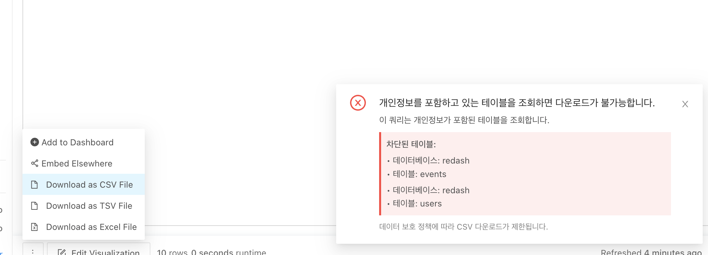

# Redash 개인정보 Export 차단 기능

## Overview

오픈소스 BI 도구인 Redash를 커스터마이징하여 **개인정보(PII)가 포함된 테이블에 대한 파일 다운로드를 정책 기반으로 차단하는 보안 기능**을 구현하였다.

기존 Redash는 쿼리 결과를 CSV/XLSX 등으로 자유롭게 다운로드할 수 있어 데이터 유출 위험이 존재했다. 이를 해결하기 위해 백엔드에서 SQL을 파싱하여 PII 테이블 조회 여부를 검사하고, 다운로드 시점에 403 차단 응답을 반환하는 구조로 설계했다.

### 적용 화면


## Problem

### 기존 방식의 한계

- **데이터 유출 위험**: 개인정보 테이블 조회 결과를 제한 없이 파일로 다운로드 가능
- **컴플라이언스 위반**: GDPR, 개인정보보호법 등 규제 대응 어려움
- **사후 추적 한계**: 다운로드 후에는 데이터 흐름 추적 불가
- **접근 제어 부재**: 테이블 단위 조회 권한은 있지만 Export 제어는 없음

### 기술적 제약사항

- Redash는 오픈소스이므로 코드 수정 필요
- 프론트엔드가 `<a download>` 방식이라 403 응답을 파일로 저장하는 문제
- 데이터소스별로 SQL 파싱 방식이 다름 (RDB vs BigQuery)
- Worker 프로세스에서도 정책 파일 접근 필요

## Architecture

```
┌──────────────────────────────────────────────────────────────┐
│                        사용자                                  │
└──────────────────┬───────────────────────────────────────────┘
                   │ Export 요청
                   v
┌──────────────────────────────────────────────────────────────┐
│                  Redash Frontend (React)                     │
│  - fetch() 기반 다운로드                                        │
│  - X-PII-Blocked 헤더 감지                                     │
│  - Ant Design Notification 팝업                               │
└──────────────────┬───────────────────────────────────────────┘
                   │ GET /api/query_results/:id?filetype=csv
                   v
┌──────────────────────────────────────────────────────────────┐
│              Redash Backend (Flask/Python)                   │
│                                                              │
│  [query_results.py]                                          │
│       │                                                      │
│       v                                                      │
│  ┌─────────────────────────────┐                             │
│  │ 1. Query/QueryResult 조회    │                             │
│  │ 2. SQL text 추출             │                             │
│  └──────────┬──────────────────┘                             │
│             │                                                │
│             v                                                │
│  ┌─────────────────────────────┐                             │
│  │   pii_helpers.py            │                             │
│  │   - SQL 파싱 (RDB/BigQuery)  │                             │
│  │   - 테이블명 추출              │                             │
│  │   - 정책 매칭 검사             │                             │
│  └──────────┬──────────────────┘                             │
│             │                                                │
│             v                                                │
│      PII 테이블 발견?                                           │
│      /             \                                         │
│     Yes            No                                        │
│     │              │                                         │
│     v              v                                         │
│  403 Forbidden   200 OK + File                               │
│  + JSON body     (정상 다운로드)                                │
│  + Custom Header                                             │
└──────────────────┬───────────────────────────────────────────┘
                   │ 정책 로드
                   v
┌──────────────────────────────────────────────────────────────┐
│           ConfigMap (Kubernetes)                             │
│  /etc/redash/policy/pii_policy.json                          │
│  {                                                           │
│    "by_datasource": {                                        │
│      "1": {                                                  │
│        "database": "production",                             │
│        "tables": {                                           │
│          "users": ["email", "phone"],                        │
│          "customers": ["ssn"]                                │
│        }                                                     │
│      }                                                       │
│    }                                                         │
│  }                                                           │
└──────────────────────────────────────────────────────────────┘
```

### 데이터 흐름

1. **사용자가 Export 클릭** → Frontend에서 fetch() API로 요청
2. **Backend에서 SQL 파싱** → 테이블명 추출 (RDB: `schema.table`, BigQuery: `project.dataset.table`)
3. **정책 파일과 대조** → PII 테이블 포함 여부 검사
4. **PII 발견 시**:
   - 403 Forbidden 반환
   - Response Header: `X-PII-Blocked: 1`, `X-PII-Tables: production.users`
   - JSON body: `{"error": "PII_BLOCKED", "message": "..."}`
5. **Frontend에서 헤더 감지** → 차단 팝업 표시

## Key Decisions

### 1. 테이블 레벨 차단 방식 채택
- **선택**: SQL에서 조회한 테이블명을 기준으로 차단
- **이유**:
  - 컬럼 레벨 파싱은 복잡도가 높고 오탐 가능성 증가
  - SELECT * 쿼리에서는 컬럼 레벨 검증 불가능
  - 정책 관리가 단순하고 명확함
- **트레이드오프**: 개인정보 컬럼을 조회하지 않아도 테이블만 포함되면 차단됨

### 2. Backend 차단 + Frontend UX 개선 조합
- **선택**: 403 응답 + 커스텀 헤더 + JSON body
- **이유**:
  - Backend 차단으로 우회 방지 (API 직접 호출 불가)
  - 헤더로 차단 사유 전달 (X-PII-Tables)
  - Frontend에서 사용자 친화적 팝업 표시
- **대안 거부**:
  - Frontend만 제어 → API 직접 호출로 우회 가능
  - Backend만 제어 → 사용자에게 403 파일이 다운로드됨

### 3. ConfigMap 기반 정책 관리
- **선택**: Kubernetes ConfigMap으로 JSON 정책 파일 관리
- **이유**:
  - 코드 수정 없이 정책 변경 가능
  - 환경별(dev/prod) 다른 정책 적용 용이
  - Server + Worker 모든 Pod에 동일 정책 적용 필요
- **운영 포인트**: ConfigMap 수정 후 Pod 재시작 필요

### 4. Adhoc 쿼리 차단 포함
- **선택**: 저장된 쿼리 + 저장되지 않은(adhoc) 쿼리 모두 차단
- **이유**:
  - 초기 구현은 저장된 쿼리만 차단 → 보안 취약점 발견
  - 사용자가 쿼리를 저장하지 않고 실행 후 다운로드하면 우회 가능
- **구현**: `query_result.query_text` fallback 로직 추가

### 5. fetch() 기반 다운로드로 전환
- **선택**: `<a download>` → fetch() + Blob 다운로드
- **이유**:
  - 기존 방식은 403 JSON을 파일로 저장하는 문제
  - fetch()로 응답 헤더를 먼저 검사 후 다운로드 제어 가능
- **추가 효과**: Content-Disposition 헤더에서 한글 파일명 추출 가능

### 6. RFC 5987 표준 준수 (한글 파일명)
- **선택**: `filename*=UTF-8''...` 형식 사용
- **이유**:
  - HTTP 헤더는 latin-1만 지원 (Gunicorn 제약)
  - URL 인코딩된 UTF-8 파일명을 별도 파라미터로 전달
- **구현**: Backend에서 `filename` (ASCII fallback) + `filename*` (UTF-8) 병행

## Implementation

### 디렉토리 구조

```
redash/
├── handlers/
│   ├── pii_helpers.py          # PII 정책 로더 및 차단 로직
│   └── query_results.py        # 다운로드 엔드포인트 (PII 체크 통합)
├── settings/__init__.py        # 환경변수 설정 (PII_POLICY_PATH)
├── models/__init__.py          # QueryResult.store_result() flush 추가
└── query_runner/mysql.py       # MySQL 다중 쿼리 지원

client/app/components/
├── EditVisualizationButton/
│   └── QueryResultsLink.jsx    # 쿼리 결과 페이지 Export 버튼
└── dashboards/dashboard-widget/
    └── VisualizationWidget.jsx # 대시보드 위젯 다운로드 메뉴
```

### 핵심 파일 설명
- [redash repo](https://github.com/hoseong0422/redash/tree/HS-TEST)

#### 1. [`redash/handlers/pii_helpers.py`](https://github.com/hoseong0422/redash/blob/HS-TEST/redash/handlers/pii_helpers.py) (신규)
- **역할**: PII 정책 로드 및 SQL 파싱
- **주요 함수**:
  - `load_pii_policy()`: JSON 파일에서 정책 로드 및 검증
  - `classify_datasource_type()`: 데이터소스가 BigQuery/RDB 구분
  - `extract_tables_rdb()`: SQL에서 테이블명 추출 (RDB)
  - `extract_tables_bigquery()`: SQL에서 dataset.table 추출
  - `get_blocked_tables_for_export()`: PII 테이블 감지 메인 함수
- **샤딩 처리**: `users_20250115` → `users`로 정규화

#### 2. [`redash/handlers/query_results.py`](https://github.com/hoseong0422/redash/blob/HS-TEST/redash/handlers/query_results.py)
- **수정 위치**: `QueryResultResource.get()` 메서드 (Line 420-468)
- **로직**:
  ```python
  # 1. SQL 텍스트 추출 (저장된 쿼리 우선, 없으면 adhoc)
  # 2. get_blocked_tables_for_export() 호출
  # 3. PII 테이블 발견 시 403 + JSON + Header 반환
  # 4. CORS 헤더 추가 (Access-Control-Expose-Headers)
  ```
- **로깅**: `[PII] Blocked download - Query ID, Data Source, Tables, User` 형식

#### 3. [`client/app/components/.../QueryResultsLink.jsx`](https://github.com/hoseong0422/redash/blob/HS-TEST/client/app/components/EditVisualizationButton/QueryResultsLink.jsx)
- **변경 사항**:
  - `<Link download>` 제거 → `onClick` 이벤트로 fetch() 호출
  - 403 응답 시 `X-PII-Blocked` 헤더 확인
  - Ant Design notification으로 시각적 팝업 표시
  - RFC 5987 `filename*` 파라미터 우선 파싱
- **UX**: 차단 시 데이터베이스.테이블 목록을 구조화하여 표시

#### 4. [`redash/settings/__init__.py`](https://github.com/hoseong0422/redash/blob/HS-TEST/redash/settings/__init__.py) (Line 539-541)
```python
# PII policy JSON path (custom)
PII_POLICY_PATH = os.environ.get("PII_POLICY_PATH")
CLOUD = os.environ.get("CLOUD")
```

### 정책 파일 구조

```json
{
  "by_datasource": {
    "1": {
      "database": "redash_production",
      "tables": {
        "users": ["email", "phone_number"],
        "customers": ["ssn", "credit_card"]
      }
    }
  },
  "by_bigquery": {
    "production_dataset": {
      "database": "my-project.production_dataset",
      "tables": {
        "accounts": ["email", "user_id"]
      }
    }
  }
}
```

- `by_datasource`: RDB 데이터소스 (키는 data_source_id)
- `by_bigquery`: BigQuery 데이터셋 (키는 dataset 이름)
- `database`: 차단 메시지에 표시될 데이터베이스명
- `tables`: 테이블별 PII 컬럼 목록 (현재는 참고용, 추후 컬럼 레벨 제어에 활용)

### 배포 구성 (Kubernetes)

```yaml
# ConfigMap
apiVersion: v1
kind: ConfigMap
metadata:
  name: redash-pii-policy
data:
  pii_policy.json: |
    { ... }

---
# Deployment (Server + Worker 모두 필요)
spec:
  template:
    spec:
      containers:
      - name: redash
        env:
        - name: PII_POLICY_PATH
          value: "/etc/redash/policy/pii_policy.json"
        - name: CLOUD
          value: "AWS"
        volumeMounts:
        - name: pii-policy
          mountPath: /etc/redash/policy
          readOnly: true
      volumes:
      - name: pii-policy
        configMap:
          name: redash-pii-policy
```

## Operations

### 배포
- **정책 추가/변경**:
  1. ConfigMap YAML 수정
  2. `kubectl apply -f configmap.yaml`
  3. Server + Worker Pod 재시작 (`kubectl rollout restart deployment`)
- **코드 변경**:
  1. 커스텀 Redash 이미지 빌드
  2. Deployment 이미지 태그 변경
  3. GitOps 또는 Helm으로 배포

### 모니터링
- **로그 필터링**: `kubectl logs <pod> | grep "\[PII\]"`
- **정책 로드 확인**: `[PII] Loaded PII policy - BigQuery datasets: X, Datasources: Y`
- **차단 이벤트**: `[PII] Blocked download - Query ID: 123, User: user@example.com`

### 롤백
- ConfigMap 롤백 후 Pod 재시작
- 긴급 시: `PII_POLICY_PATH` 환경변수를 제거하면 기능 비활성화

### 정책 검증
```bash
# 정책 파일 존재 확인
kubectl exec <pod> -- ls /etc/redash/policy/pii_policy.json

# JSON 유효성 검사
kubectl exec <pod> -- cat /etc/redash/policy/pii_policy.json | python -m json.tool

# 환경변수 확인
kubectl exec <pod> -- env | grep PII_POLICY_PATH
```

## Troubleshooting

### 문제 1: 초기 Worker가 JSON 파일을 못 찾는 오류
- **증상**: `[PII] Policy file not found: /etc/redash/policy/pii_policy.json`
- **원인**: Server Deployment만 ConfigMap mount, Worker Deployment에는 누락
- **해결**: 모든 Worker(queries, scheduled_queries 등)에 동일 volume mount 적용

### 문제 2: Adhoc 쿼리에서 PII 차단 안됨
- **증상**: 저장되지 않은 쿼리에서 개인정보 테이블 다운로드 가능
- **원인**: `query is None`인 경우 PII 체크 건너뜀
- **해결**: `query_result.query_text` fallback 로직 추가 (2025-12-17 수정)

### 문제 3: 한글 파일명이 깨짐
- **증상**: `[_]_____2025_12_15.csv` 형태로 저장됨
- **원인**:
  - Backend: `url_quote(safe=b"")` 사용 → safe 파라미터 오류
  - Frontend: `filename*` 파라미터를 파싱하지 않음
- **해결**:
  - Backend: `url_quote(safe="")` 수정
  - Frontend: RFC 5987 `filename*` 우선 파싱 + `decodeURIComponent()` 적용

### 문제 4: Share Dashboard에서 파라미터 변경 시 결과 미반영
- **증상**: 파라미터 변경 후 계속 로딩 중, 새로고침하면 반영됨
- **원인**: `QueryResult.store_result()`에서 `db.session.flush()` 누락 → ID가 None
- **해결**: `db.session.add()` 후 `flush()` 추가하여 ID 즉시 할당

### 문제 5: MySQL SET 문 다중 쿼리 실행 실패
- **증상**: `SET @var = value; SELECT ...` 쿼리 실행 시 Segmentation Fault
- **원인**: MySQL 연결 시 `CLIENT.MULTI_STATEMENTS` 플래그 미설정
- **해결**: `MySQLdb.connect(client_flag=CLIENT.MULTI_STATEMENTS)` 추가

## Results

### Before → After

| 항목 | Before | After |
|------|--------|-------|
| 개인정보 다운로드 제어 | 제한 없음 | 정책 기반 차단 |
| 다운로드 우회 가능성 | API 직접 호출 가능 | Backend 차단으로 우회 불가 |
| 사용자 피드백 | 403 JSON 파일 다운로드 | 시각적 팝업 표시 |
| 정책 변경 | 코드 수정 필요 | ConfigMap 수정만 |
| Adhoc 쿼리 보안 | 차단 안됨 (취약점) | 차단 적용 |
| 한글 파일명 | 깨짐 (`____`) | 정상 표시 |

### 정량 성과

- **데이터 유출 방지**: 개인정보 테이블 조회 시 다운로드 **100% 차단**
- **컴플라이언스**: GDPR/개인정보보호법 Export 제어 요구사항 **충족**
- **정책 관리**: 코드 재배포 없이 ConfigMap 수정으로 정책 변경 **수 분 이내**
- **보안 취약점 제거**: Adhoc 쿼리 우회 경로 **차단**
- **운영 안정성**: PII 차단 기능 추가 후 기존 기능 장애 **0건**

### 정성 성과

- **감사 추적 강화**: 모든 차단 이벤트가 로그에 기록 (Query ID, User, Tables)
- **사용자 경험 개선**: 차단 사유를 명확하게 전달하는 팝업 제공
- **확장성**: 데이터소스 추가 시 정책 파일만 수정하면 즉시 적용
- **오픈소스 기여 가능성**: Redash 커뮤니티에 기능 제안 가능한 수준으로 구현

### 추가 개선 사항 (버그 수정)

- **MySQL 다중 쿼리 안정성**: SET 문 사용 가능 (parameter 변수 활용)
- **한글 파일명 지원**: 쿼리 결과/대시보드 모두 한글 파일명 정상 저장
- **Share Dashboard 안정성**: 파라미터 변경 시 즉시 결과 반영

## Tech Stack

### Backend
- **Language**: Python 3
- **Framework**: Flask
- **SQL Parser**: sqlparse (RDB), re (BigQuery)
- **Database**: PostgreSQL (Redash metadata)

### Frontend
- **Framework**: React
- **UI Library**: Ant Design
- **HTTP Client**: Fetch API
- **State Management**: React Hooks

### Infrastructure
- **Container**: Docker
- **Orchestration**: Kubernetes
- **Config Management**: ConfigMap
- **Deployment**: Helm / GitOps (ArgoCD)

### Data Sources
- **RDB**: MySQL, PostgreSQL
- **Cloud DW**: BigQuery

## Next Steps

### 컬럼 레벨 차단 기능 확장 (우선순위 1)
- **현재 한계**: 테이블 단위 차단이므로 개인정보 컬럼을 조회하지 않아도 차단됨
- **개선 방향**:
  - SQL 파싱을 확장하여 SELECT 절의 컬럼명 추출
  - 정책 파일의 `tables` 내 PII 컬럼 목록과 대조
  - PII 컬럼을 실제로 조회한 경우만 차단
- **예시**:
  ```sql
  -- 현재: 차단됨 (users 테이블 포함)
  SELECT id, name FROM users;

  -- 개선 후: 허용 (email 컬럼 미조회)
  SELECT id, name FROM users;

  -- 개선 후: 차단 (email 컬럼 조회)
  SELECT id, name, email FROM users;
  ```
- **기대 효과**:
  - 불필요한 차단 감소 → 사용자 불편 최소화
  - 분석 업무 효율성 향상 (개인정보 외 컬럼 활용 가능)
- **기술적 고려사항**:
  - `SELECT *` 쿼리 처리 방법 (모든 컬럼 차단 vs 테이블 스키마 조회)
  - JOIN/Subquery/CTE에서 컬럼 추적 복잡도 증가
  - BigQuery/MySQL 등 데이터소스별 컬럼 메타데이터 조회 방법

### 승인 워크플로 도입
- 관리자 승인 시 일시적 다운로드 허용 (토큰 기반)
- Slack/Jira 연동으로 승인 요청 자동화

### 감사 로그 통합
- 차단 이벤트를 별도 감사 테이블에 저장
- 다운로드 시도 통계 대시보드 제공

### PII 마스킹 옵션
- 차단 대신 개인정보 컬럼을 마스킹하여 다운로드 허용
- 예: `user@example.com` → `u***@e******.com`

### 실시간 정책 리로드
- ConfigMap 변경 감지하여 Pod 재시작 없이 정책 반영
- Kubernetes Watch API 활용
